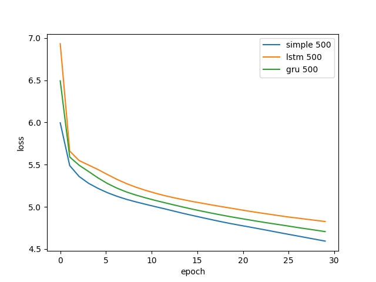
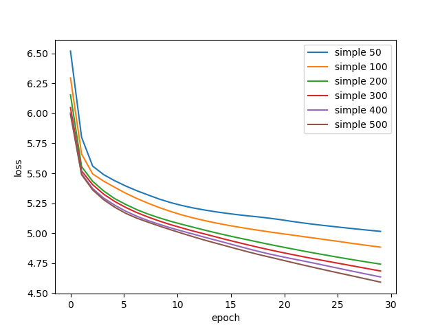

# Chapter 4: generating text with a Recurrent Neural Net

Install NLTK lib:

    conda install nltk

Download the english nltk data:

    python -c "import nltk; nltk.download('book')"

Train the simple recurrent network:

    python train.py --model simple

Train the LSTM network:

    python train.py --model lstm

Train the GRU network:

    python train.py --model gru

Predict new texts with the model:

    python predict.py --model simple

Different models on 30 epochs, with 500 hidden units:

Differnt hidden size for the simple model:

LSTM on 150 epochs, 500 hidden units, voc size 1500:

LSTM on 150 epochs, 500 hidden units, voc size 9000:

